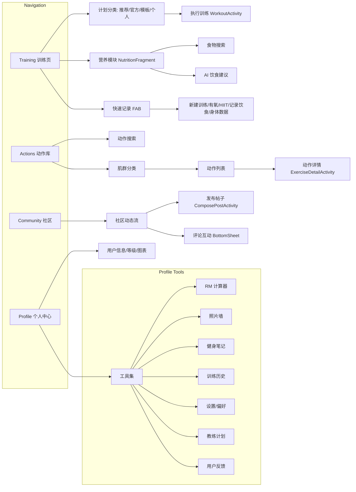

# TrainTrack 软件设计文档

---

## 目录

1. [引言](#1-引言)
2. [需求规格说明](#2-需求规格说明)
3. [总体设计](#3-总体设计)
4. [用户界面设计](#4-用户界面设计)
5. [关键技术](#5-关键技术)
6. [测试与用户体验分析](#6-测试与用户体验分析)
7. [结论](#7-结论)

---

## 1. 引言

### 1.1 项目概述

**TrainTrack** 是一款专为健身爱好者设计的综合性健身管理 Android 应用程序。该应用旨在为用户提供一站式的健身解决方案，涵盖训练计划管理、动作库查询、营养追踪、社区互动和个人档案管理等核心功能。

### 1.2 项目目标

- **个性化训练**：提供官方推荐、模板计划和个人自定义训练方案
- **全面动作库**：覆盖全身各肌群的专业动作指导与演示
- **智能营养管理**：集成食物搜索、AI 饮食建议和碳水循环设置
- **社区互动**：支持用户发帖、评论和互动交流
- **数据追踪**：记录训练历史、身体数据和成就进度

### 1.3 项目范围

本应用面向 Android 平台，支持 Android 7.0 (API 24) 及以上版本。应用采用原生 Kotlin 开发，遵循 MVVM 架构模式，支持离线数据存储，并集成第三方 API 实现食物查询和 AI 饮食建议功能。

---

## 2. 需求规格说明

### 2.1 用户需求

| 用户类型 | 核心需求 |
|---------|---------|
| 健身新手 | 获取专业的训练计划指导，学习正确的动作要领 |
| 健身爱好者 | 记录训练数据，追踪进度，获取营养建议 |
| 健身达人 | 自定义训练计划，分享健身心得，参与社区互动 |

### 2.2 功能需求

#### 2.2.1 训练模块 (Training)

| 功能 | 描述 |
|-----|------|
| 智能推荐 | 基于用户目标智能推荐训练计划 |
| 官方计划 | 提供减脂、增肌(男/女)、力量举等分类计划 |
| 模板计划 | 预设推/拉/腿等经典训练模板 |
| 个人计划 | 支持用户创建自定义训练计划 |
| 快捷记录 | 一键添加饮食、训练、HIIT、有氧、休息日记录 |

#### 2.2.2 动作库模块 (Actions)

| 功能 | 描述 |
|-----|------|
| 肌群分类 | 按胸部、背部、肩部、手臂、腿部、核心等肌群分类 |
| 动作搜索 | 支持关键词搜索动作 |
| 动作详情 | 展示动作名称、目标肌群、动作要领和 GIF 演示 |

#### 2.2.3 社区模块 (Community)

| 功能 | 描述 |
|-----|------|
| 动态浏览 | 浏览社区用户发布的健身动态 |
| 发布帖子 | 支持文字和图片的帖子发布 |
| 评论互动 | 对帖子进行评论和互动 |
| 点赞关注 | 支持点赞和关注功能 |

#### 2.2.4 营养模块 (Nutrition)

| 功能 | 描述 |
|-----|------|
| 饮食记录 | 记录三餐和加餐的食物摄入 |
| 食物搜索 | 集成 FatSecret API 搜索食物营养信息 |
| 营养统计 | 展示卡路里、蛋白质、碳水、脂肪摄入 |
| AI 饮食建议 | 集成 Kimi AI 提供智能饮食建议 |
| 碳水循环 | 设置高/低碳日循环方案 |

#### 2.2.5 个人中心模块 (Profile)

| 功能 | 描述 |
|-----|------|
| 账户管理 | 头像设置、用户名编辑 |
| 等级系统 | 基于积分的用户等级展示 |
| 训练统计 | 可视化周训练数据图表 |
| 工具集 | RM 计算器、照片墙、笔记、偏好设置等 |
| 历史记录 | 查看训练历史记录 |
| 成就系统 | 解锁和展示成就徽章 |

---

## 3. 总体设计

### 3.1 系统架构

TrainTrack 采用 **MVVM (Model-View-ViewModel)** 架构模式，结合 Android Jetpack 组件实现清晰的关注点分离。

```mermaid
graph TB
    subgraph "View Layer"
        UI_Home[HomeFragment]
        UI_Work[WorkoutActivity]
        UI_Nut[NutritionFragment]
        UI_Comm[CommunityFragment]
        UI_Prof[ProfileFragment]
        XML[XML Layouts]
        Bind[ViewBinding]
    end
    
    subgraph "ViewModel Layer"
        VM_Home[HomeViewModel]
        VM_Work[WorkoutViewModel]
        VM_Nut[NutritionViewModel]
        VM_Comm[CommunityViewModel]
        VM_Prof[ProfileViewModel]
        LD[LiveData / Flow]
    end
    
    subgraph "Model Layer"
        DB[AppDatabase (Room)]
        DAO_Work[WorkoutDao]
        DAO_Nut[NutritionDao]
        DAO_User[UserDao]
        DAO_Other[Other DAOs]
        Entities[21 Data Entities]
        Engine[RecommendationEngine]
    end
    
    subgraph "External Services"
        API_Food[FatSecret API Service]
        API_AI[Kimi AI Service]
    end
    
    %% View -> ViewModel interactions
    UI_Home --> Bind
    UI_Home --> VM_Home
    UI_Work --> Bind
    UI_Work --> VM_Work
    UI_Nut --> VM_Nut
    UI_Comm --> VM_Comm
    UI_Prof --> VM_Prof
    
    %% ViewModel -> Data interactions
    VM_Home --> DAO_Work
    VM_Home --> Engine
    VM_Work --> DAO_Work
    VM_Nut --> DAO_Nut
    VM_Nut --> API_Food
    VM_Nut --> API_AI
    VM_Comm --> DAO_User
    VM_Prof --> DAO_User
    VM_Prof --> DAO_Work
    
    %% Data Layer internals
    Engine --> DAO_Work
    DAO_Work --> DB
    DAO_Nut --> DB
    DAO_User --> DB
    DAO_Other --> DB
    DB --> Entities
    
    %% ViewModel exposes LiveData
    VM_Home --> LD
    VM_Work --> LD
    VM_Nut --> LD
```

### 3.2 模块结构

```
com.example.tt/
├── MainActivity.kt                 # 主入口，底部导航控制
├── data/                           # 数据层
│   ├── AppDatabase.kt              # Room 数据库配置
│   ├── *Entity.kt                  # 21 个数据实体类
│   ├── *Dao.kt                     # 11 个数据访问对象
│   └── api/                        # 外部 API 服务
│       ├── FoodApiService.kt       # FatSecret 食物 API
│       └── KimiApiService.kt       # Kimi AI API
└── ui/                             # UI 层
    ├── home/                       # 主页模块
    │   ├── HomeFragment.kt         # 训练计划展示
    │   └── ActionsFragment.kt      # 动作库
    ├── workout/                    # 训练模块
    │   ├── WorkoutActivity.kt      # 训练执行
    │   └── ExerciseDetailActivity.kt
    ├── nutrition/                  # 营养模块
    │   ├── NutritionFragment.kt
    │   └── AiDietAdviceFragment.kt
    ├── community/                  # 社区模块
    │   ├── CommunityFragment.kt
    │   └── ComposePostActivity.kt
    ├── profile/                    # 个人中心
    │   ├── ProfileFragment.kt
    │   └── 7 个工具 Activity
    ├── challenges/                 # 挑战与成就
    └── onboarding/                 # 新手引导
```

### 3.3 数据库设计

应用使用 **Room Persistence Library** 进行本地数据存储，当前数据库版本为 7。

#### 3.3.1 核心实体

| 实体类 | 描述 |
|-------|------|
| `WorkoutSessionEntity` | 训练会话记录 |
| `WorkoutSetEntity` | 训练组详情 |
| `NutritionLogEntity` | 营养摄入日志 |
| `ExerciseEntity` | 动作信息 |
| `TrainingPlanEntity` | 训练计划 |
| `TrainingPlanDayEntity` | 计划每日安排 |
| `UserProfileEntity` | 用户档案 |
| `UserGoalEntity` | 用户目标 |
| `PostEntity` | 社区帖子 |
| `CommentEntity` | 帖子评论 |
| `AchievementEntity` | 成就定义 |
| `UserAchievementEntity` | 用户成就解锁 |
| `BodyMetricEntity` | 身体数据 |
| `UserPointsEntity` | 用户积分 |
| `UserBadgeEntity` | 用户徽章 |

#### 3.3.2 DAO 接口

| DAO | 功能 |
|-----|------|
| `WorkoutDao` | 训练数据 CRUD |
| `NutritionDao` | 营养数据 CRUD |
| `TrainingPlanDao` | 训练计划管理 |
| `UserDao` | 用户信息管理 |
| `CommentDao` | 评论管理 |
| `PointsDao` | 积分系统 |
| `BodyMetricDao` | 身体数据记录 |
| `PeriodRecordDao` | 经期记录 |
| `CardioSessionDao` | 有氧记录 |
| `HiitSessionDao` | HIIT 记录 |
| `RestDayDao` | 休息日记录 |

### 3.4 导航架构

应用采用 **Android Navigation Component** 实现单 Activity 多 Fragment 架构。



---

## 4. 用户界面设计

### 4.1 设计原则

- **Material Design 3**：遵循 Google 最新设计规范
- **深色主题**：采用深色配色，减少视觉疲劳
- **渐变强调**：使用绿色到青色渐变作为品牌色
- **卡片式布局**：信息模块化展示
- **底部导航**：4 个主要入口 + 中央 FAB 快捷操作

### 4.2 主要界面

#### 4.2.1 训练页面 (HomeFragment)

| 元素 | 设计说明 |
|-----|---------|
| 欢迎语 | 动态显示用户名，个性化问候 |
| Tab 切换 | 推荐/官方/模板/个人 四个标签页 |
| Chip 筛选 | 减脂/部位/增肌男/增肌女/力量举 分类 |
| 计划卡片 | 显示计划名称、时长、目标肌群 |
| FAB | 快捷添加记录入口 |

#### 4.2.2 动作库页面 (ActionsFragment)

| 元素 | 设计说明 |
|-----|---------|
| 搜索栏 | 顶部搜索框，实时过滤 |
| 肌群网格 | 2列网格展示肌群分类 |
| 动作列表 | 垂直列表展示动作卡片 |
| 详情页 | 动作名、目标肌群、GIF 演示、文字要领 |

#### 4.2.3 社区页面 (CommunityFragment)

| 元素 | 设计说明 |
|-----|---------|
| 动态流 | 瀑布流展示帖子 |
| 帖子卡片 | 头像、用户名、内容、图片、互动按钮 |
| FAB | 发布新帖子 |
| 评论底部弹窗 | BottomSheet 展示评论列表 |

#### 4.2.4 营养页面 (NutritionFragment)

| 元素 | 设计说明 |
|-----|---------|
| 热量环 | 圆形进度展示今日卡路里 |
| 三大营养素 | 蛋白质/碳水/脂肪进度条 |
| 餐次卡片 | 早餐/午餐/晚餐/加餐添加入口 |
| 功能入口 | 碳水循环/AI 建议/食物推荐 |

#### 4.2.5 个人中心页面 (ProfileFragment)

| 元素 | 设计说明 |
|-----|---------|
| 头像区 | 可点击更换头像 |
| 用户名 | 可编辑的用户名 |
| 等级卡片 | 等级进度条和积分展示 |
| 周统计图表 | MPAndroidChart 柱状图 |
| 工具网格 | 7 个功能入口图标 |

### 4.3 交互设计

| 交互类型 | 实现方式 |
|---------|---------|
| 页面切换 | Navigation Component + Fragment 动画 |
| 底部弹窗 | Material BottomSheetDialog |
| 加载动画 | Lottie 动画 |
| 图片加载 | Glide 图片库 |
| 表单验证 | 实时输入校验与反馈 |
| 触觉反馈 | 缩放动画 + Toast 提示 |

---

## 5. 关键技术

### 5.1 技术栈

| 类别 | 技术 | 版本 |
|-----|------|------|
| **语言** | Kotlin | 2.0.21 |
| **最低 SDK** | Android 7.0 | API 24 |
| **目标 SDK** | Android 14 | API 34 |
| **架构** | MVVM | - |
| **数据库** | Room | 2.6.1 |
| **网络** | Retrofit + OkHttp | 2.9.0 / 4.11.0 |
| **异步** | Kotlin Coroutines | 1.7.3 |
| **生命周期** | Lifecycle | 2.8.7 |
| **导航** | Navigation | - |
| **图表** | MPAndroidChart | 3.1.0 |
| **图片** | Glide | 4.16.0 |
| **动画** | Lottie | 6.3.0 |
| **Markdown** | Markwon | 4.6.2 |
| **注解处理** | KSP | 2.0.21-1.0.26 |

### 5.2 核心技术实现

#### 5.2.1 Room 数据库

```kotlin
@Database(
    entities = [
        WorkoutSessionEntity::class,
        WorkoutSetEntity::class,
        NutritionLogEntity::class,
        // ... 共 21 个实体
    ],
    version = 7,
    exportSchema = false
)
abstract class AppDatabase : RoomDatabase() {
    abstract fun workoutDao(): WorkoutDao
    abstract fun nutritionDao(): NutritionDao
    // ... 共 11 个 DAO
}
```

#### 5.2.2 MVVM 架构

```kotlin
class HomeViewModel : ViewModel() {
    private val _planCards = MutableLiveData<List<PlanCard>>()
    val planCards: LiveData<List<PlanCard>> = _planCards
    
    fun loadSmartRecommendations(context: Context) {
        viewModelScope.launch {
            // 异步加载数据
            val recommendations = RecommendationEngine.getRecommendations(context)
            _planCards.postValue(recommendations)
        }
    }
}
```

#### 5.2.3 Retrofit API 集成

```kotlin
interface FoodApiService {
    @GET("foods/search")
    suspend fun searchFoods(
        @Query("search_expression") query: String,
        @Query("max_results") maxResults: Int = 10
    ): FoodSearchResponse
}
```

### 5.3 技术挑战与解决方案

| 挑战 | 解决方案 |
|-----|---------|
| **数据库迁移** | 使用 `fallbackToDestructiveMigration()` 简化开发阶段迁移 |
| **GIF 动画播放** | 使用 Glide 的 GIF 解码器高效播放动作演示 |
| **实时搜索** | TextWatcher + Debounce 减少搜索频率 |
| **Markdown 渲染** | Markwon 库渲染 AI 返回的 Markdown 格式建议 |
| **图表性能** | MPAndroidChart 硬件加速 + 数据分页 |
| **内存优化** | Glide 图片缓存策略 + ViewBinding 防止内存泄漏 |
| **多设备适配** | ConstraintLayout + 响应式布局 |

---

## 6. 测试与用户体验分析

### 6.1 测试概况

应用在第三方云平台上进行了全面的兼容性和稳定性测试，覆盖多种机型和操作系统版本。

#### 6.1.1 测试通过率


**测试结论**：
- 测试通过率：**100%**
- 测试内容涵盖：初始化、安装、启动、遍历检查
- 应用稳定性良好，无安装失败、运行失败情况
- 验证了不同系统下的高稳定性

#### 6.1.2 终端兼容性详情

| 机型 | 操作系统 | 分辨率 | 测试结果 |
|-----|---------|-------|---------|
| 小米 15 | Android 16 | 1200 × 2670 | ✅ 通过 |
| Redmi K70 | Android 15 | 1440 × 3200 | ✅ 通过 |
| 华为 Mate 60 | HarmonyOS 4 | 1216 × 2688 | ✅ 通过 |
| OPPO A5 Pro | Android 15 | 1080 × 2412 | ✅ 通过 |
| Vivo X50 | Android 10 | 1080 × 2376 | ✅ 通过 |

### 6.2 性能分析

#### 6.2.1 小米 15 性能测试示例


**性能指标**：
| 指标 | 表现 |
|-----|------|
| CPU 占用 | 峰值控制良好，无异常抖动 |
| 内存占用 | 稳定在 ~180MB 左右，无内存泄漏 |
| 启动时间 | 冷启动迅速，体验流畅 |

**稳定性总结** (通过 Monkey 测试与遍历检查)：
- 安装失败率：**0%**
- 启动失败率：**0%**
- 运行崩溃率：**0%**

> 日志显示 SurfaceFlinger 与 SDM 渲染正常，无严重报错 (E/Fatal)

### 6.3 用户体验反馈

#### 6.3.1 用户评分分布


基于用户真实反馈数据，App 获得了较高的认可度，尤其在功能全面性上备受好评。

**评分分布 (App Rating)**:
| 评分 | 比例 |
|-----|------|
| 10 分 | 29.4% |
| 9 分 | 23.5% |
| 8 分 | 23.5% |
| 7 分 | 0% |
| 5 分 | 0% |
| 3 分 | 0% |

**用户评价精选**：
> "功能很齐全，基本满足我日常健身的需求。"

> "AI 饮食建议很有用，期待成品！"

#### 6.3.2 收集到的问题与改进措施

| 问题类别 | 问题描述 | 改进措施 |
|---------|---------|---------|
| **UI 排版** | 首页图标大小不一，视觉杂乱 | UI 重构：统一图标规范，优化排版间距 |
| **功能 Bug** | "添加早餐"无反馈，列表不刷新 | 交互优化：修复异步刷新问题，增加弹窗反馈 |
| **新手引导** | 小白用户缺乏指引，上手难 | Onboarding：增加新手指引页与初始教程 |

---

## 7. 结论

### 7.1 项目概述

TrainTrack 是一款功能完备的健身管理应用，成功实现了训练计划管理、动作库查询、营养追踪、社区互动和个人档案管理五大核心模块。应用采用现代 Android 开发技术栈，遵循 MVVM 架构，确保了代码的可维护性和扩展性。

### 7.2 取得的成果

| 成果 | 描述 |
|-----|------|
| **功能完整性** | 实现了全部规划功能，涵盖健身全流程 |
| **技术架构** | 建立了稳健的 MVVM + Room + Retrofit 技术架构 |
| **兼容性** | 100% 测试通过率，兼容 Android 10 ~ Android 16 及 HarmonyOS |
| **用户满意度** | 76.4% 用户给出 8 分及以上评分 |
| **性能表现** | 内存稳定、启动迅速、无崩溃 |

### 7.3 开发过程中遇到的挑战

| 挑战 | 解决过程 |
|-----|---------|
| **数据库版本迁移** | 多次实体变更导致迁移复杂，采用 destructive migration 策略简化开发 |
| **GIF 资源管理** | 大量动作 GIF 占用空间，通过资源压缩和 Glide 缓存优化 |
| **AI API 集成** | Kimi AI 返回格式不稳定，使用 Markwon 库兼容 Markdown 渲染 |
| **多设备适配** | 不同分辨率下 UI 错乱，采用 ConstraintLayout 实现响应式布局 |
| **异步数据同步** | Room + LiveData 数据流管理复杂，统一使用 ViewModel 封装 |

### 7.4 未来改进方案

| 方向 | 具体计划 |
|-----|---------|
| **新手引导** | 增加首次启动引导页和功能提示 |
| **云同步** | 接入 Firebase 实现跨设备数据同步 |
| **社交功能增强** | 增加好友系统、私信功能、动态分享 |
| **训练分析** | 提供更详细的训练数据分析和进度报告 |
| **穿戴设备** | 对接智能手表、手环等穿戴设备 |
| **国际化** | 增加多语言支持，拓展海外市场 |
| **性能优化** | 进一步优化启动速度和内存占用 |
| **单元测试** | 完善单元测试和 UI 测试覆盖率 |

---

**文档版本**：v1.0  
**编写日期**：2025年12月26日  
**项目团队**：TrainTrack 开发团队
